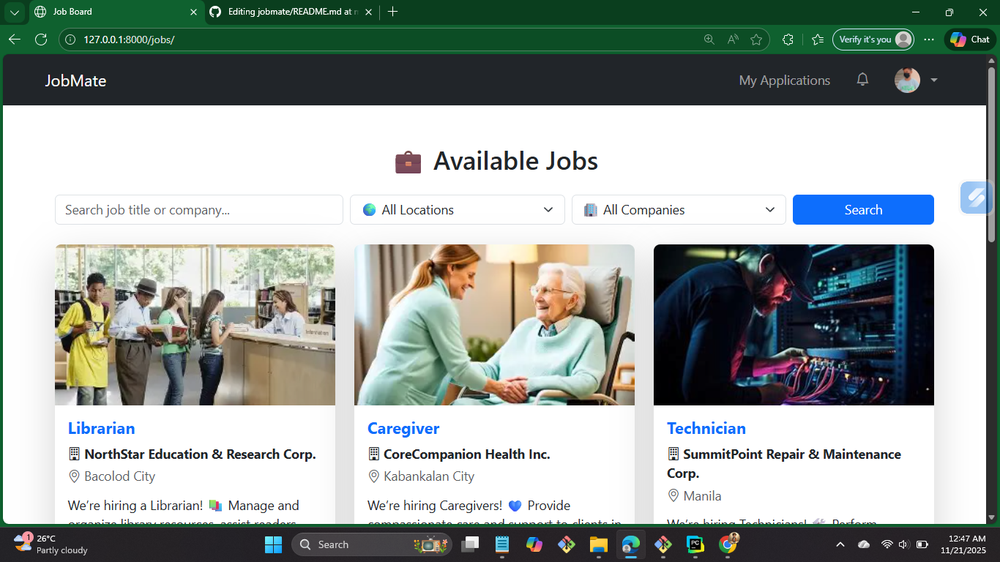
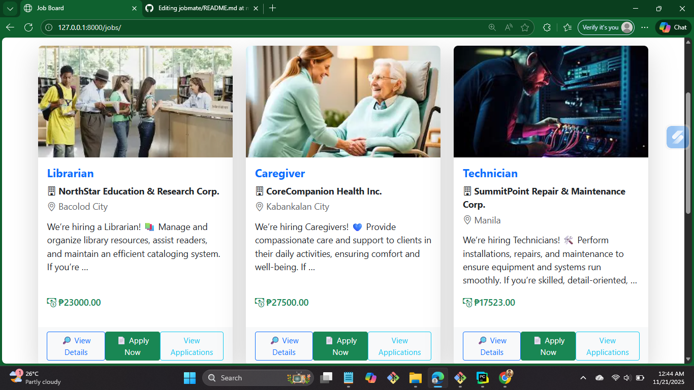
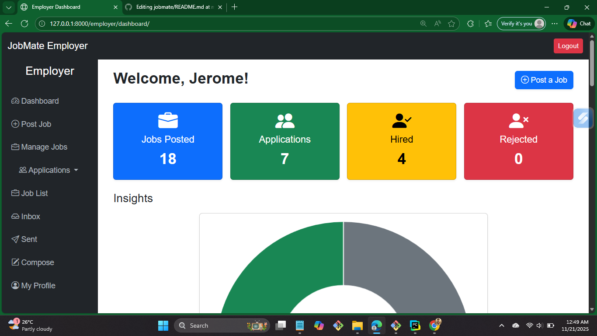
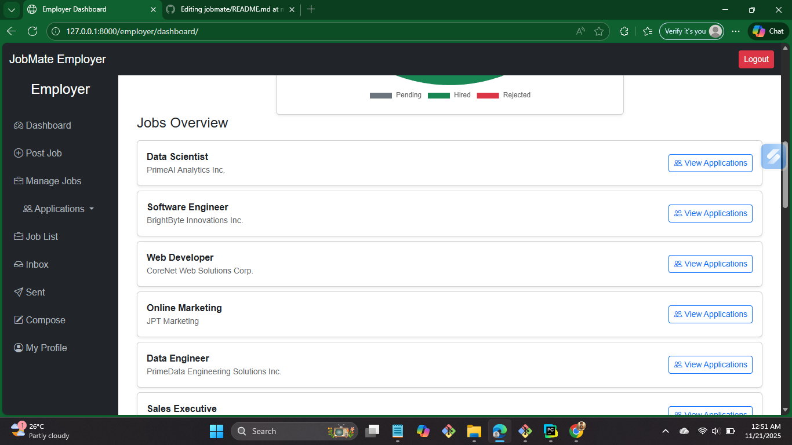
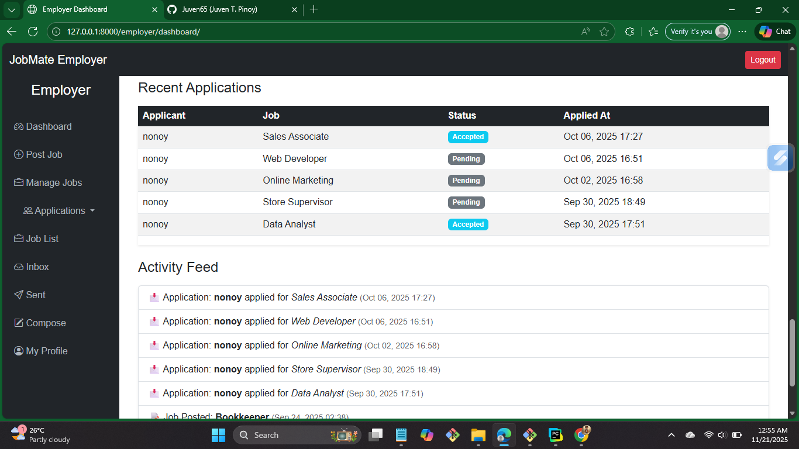
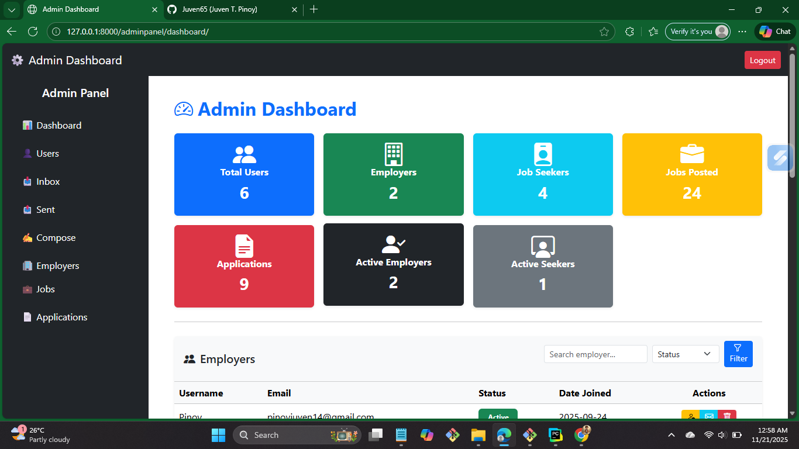
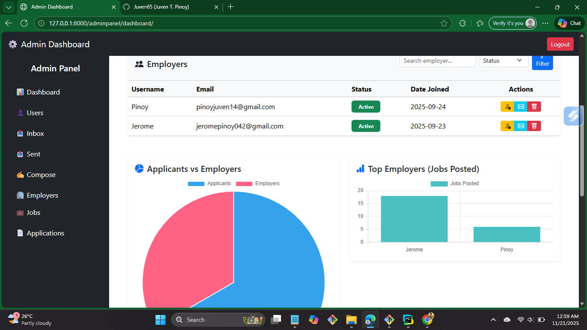
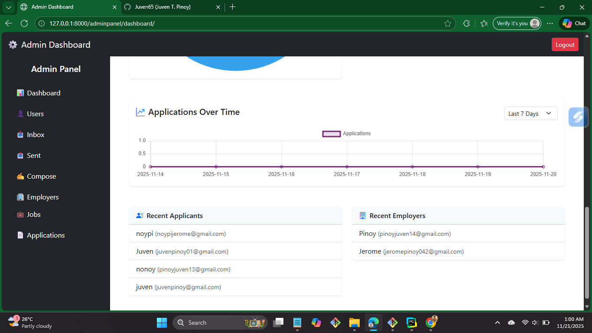

# 🧑‍💼 JobMate – Django Job Portal

> **Developer Note:** Lahat ng codes, structures, explanations, at logic na ginamit sa project na ito ay galing at tinulungan ni **ChatGPT**. 😊

JobMate is a full-featured job portal built with **Django**, offering three main user roles with complete authentication, dashboards, and job management.

---

## 🚀 Features

### 🔹 **Job Seekers**

* Sign up / login
* Upload resume
* Browse & search jobs
* Apply to jobs
* View application history

### 🔹 **Employers**

* Register & login
* Create and manage job postings
* View applicants
* Edit & delete job listings

### 🔹 **Admin Panel**

* Full analytics dashboard (Chart.js)
* Manage all users (activate / deactivate)
* View recent applicants
* Admin charts and insights

---

## ✉️ Email System

### **Email Verification (Activation)**

* New users receive an activation link
* Token-protected
* Link expires
* Prevents fake signups

### **Password Reset via Email**

* Users enter their email to request reset link
* Secure token-based password reset
* Auto-expiring reset URL

---

## 🛠️ Tech Stack

* **Backend:** Django 5+
* **Frontend:** Bootstrap 5, FontAwesome
* **Database:** SQLite (default), MySQL compatible
* **Charts:** Chart.js
* **Email:** SMTP (Gmail / Custom)
* **Auth:** Django Auth + Role-Based Access

---

## 📷 Screenshots

### Homepage / Job Listings




### Employer Dashboard





### Admin Analytics Dashboard





---

## ❤️ Credits

**Developer: Juven T. Pinoy**
🎓 Information Technology Graduate – Carlos Hilado Memorial State University (2025)
🌐 GitHub: [https://github.com/Juven65](https://github.com/Juven65)

**Code Assistance:** ChatGPT (AI-generated guidance and code support)
**UI:** Bootstrap 5

---

## ⚙️ Setup Instructions

```bash
# Clone the repository
git clone https://github.com/Juven65/jobmate.git
cd jobmate

# Create a virtual environment
python -m venv venv

# Activate environment
# Windows
venv\Scripts\activate
# Mac/Linux
source venv/bin/activate

# Install dependencies
pip install -r requirements.txt

# Migrate database
python manage.py migrate

# Create admin (optional)
python manage.py createsuperuser

# Run server
python manage.py runserver
```

---

## 🗂️ Project Structure

```
jobmate/
│
├── accounts/           # User accounts, roles, auth
├── jobs/               # Job listings, applications
├── dashboard/          # Admin & employer dashboards
├── static/             # CSS, JS, images
├── templates/          # HTML templates
├── media/              # Uploaded resumes
│
├── manage.py
├── db.sqlite3
├── requirements.txt
└── README.md
```


